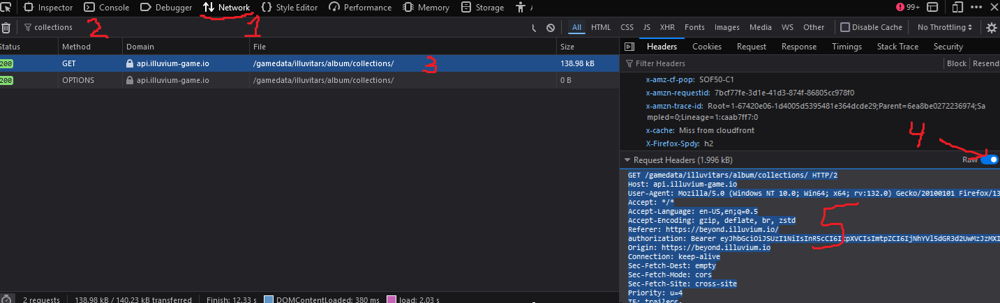
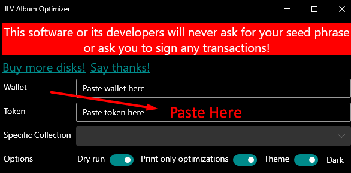

# ILV Album Optimizer
## _Sleeve/Unsleeve whole album/collection with a single click_

ILV Album Optimizer is a windoews application that helps with sleeving and unsleeving you illuvium beyond album.

## ⚠⚠⚠This software or its developers will never ask for your seed phrase or ask you to sign any transactions!⚠⚠⚠

## **[Recomended]** Usage with Firefox

- Open Firefox.
- Go to [Illuvidex].
  - If you're not logged in, do so
  - You're done!

## Usage with Chrome

- Open Chrome.
- Go to [Illuvidex].
  - If you're not logged in, do so.
  - Open Developer tools: CTRL + SHIFT + I
  - Open Application tab
  - Open Local Storage
    - **[Recomended]** Copy the whole value for 'persist:auth' key.
    - Copy the token only.
	

## Tech

ILV Album Optimizer uses a number of open source projects to work properly:

- [ModernWPFUI] - Front end.
- [Imx.Sdk] - Reading assets from immutable x blockchain.

And of course Dillinger itself is open source with a [public repository][dill]
 on GitHub.

## Development

Want to contribute? Great!
Want to support me? Use my [affiliate link when you buy more disks](https://illuvidex.illuvium.io/).
Want to gift something on-chain? 0xNed.crypto (0x40e816b38af1e2cc60859bc7f9be01f3ce78c3c0)

## License

MIT

**Free Software, Hell Yeah!**

[//]: # (References)
   [Illuvidex]: <https://illuvidex.illuvium.io/>
   [Affiliate]: <https://illuvidex.illuvium.io/>
